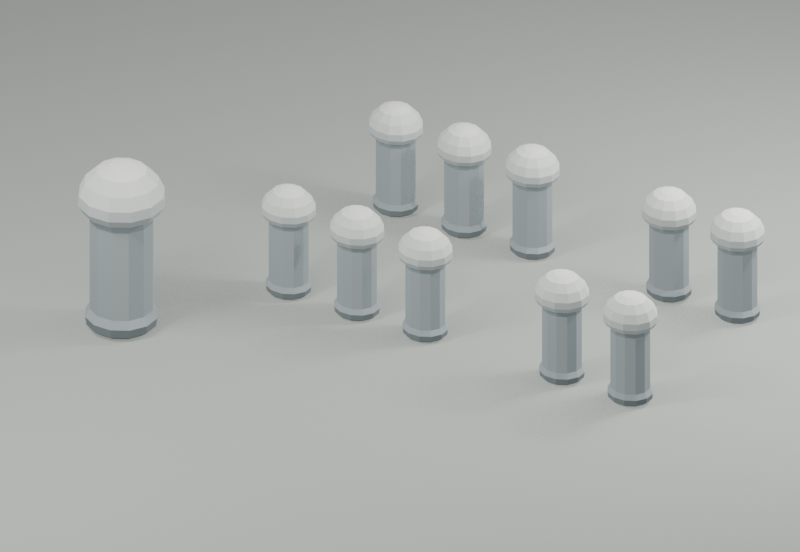

# Johto source and model index

Original editable Blender scenes and raw JSON runtime models are ordinary files in this repository. No reconstruction is needed to open a `.blend` file in Blender. Source previews are authoring views, not gameplay screenshots.

Only PNG files that exist are displayed below. A missing preview does not imply that a scene has been visually reviewed.

## Editable scenes

| Source | Native bytes | Authoring preview |
| --- | ---: | --- |
| [actor-props-01.blend](source/actor-props-01.blend) | 231,660 | Not rendered |
| [actor-props-02.blend](source/actor-props-02.blend) | 482,358 | Not rendered |
| [actor-props-03.blend](source/actor-props-03.blend) | 421,901 | Not rendered |
| [actor-props-04.blend](source/actor-props-04.blend) | 402,095 | Not rendered |
| [actor-props-05.blend](source/actor-props-05.blend) | 688,826 | Not rendered |
| [actor-props-06.blend](source/actor-props-06.blend) | 694,875 | Not rendered |
| [actor-props-07.blend](source/actor-props-07.blend) | 150,241 | Not rendered |
| [actor-props-cyndaquil-refinement.blend](source/actor-props-cyndaquil-refinement.blend) | 1,286,945 | Not rendered |
| [actor-props-sudowoodo-refinement.blend](source/actor-props-sudowoodo-refinement.blend) | 1,646,196 | Not rendered |
| [actor-props-totodile-refinement.blend](source/actor-props-totodile-refinement.blend) | 1,066,864 | Not rendered |
| [battle-species-01.blend](source/battle-species-01.blend) | 359,034 | Not rendered |
| [battle-species-02.blend](source/battle-species-02.blend) | 319,999 | Not rendered |
| [battle-species-03.blend](source/battle-species-03.blend) | 326,791 | Not rendered |
| [battle-species-04.blend](source/battle-species-04.blend) | 311,915 | Not rendered |
| [battle-species-05.blend](source/battle-species-05.blend) | 326,551 | Not rendered |
| [battle-species-06.blend](source/battle-species-06.blend) | 336,704 | Not rendered |
| [battle-species-07.blend](source/battle-species-07.blend) | 356,650 | Not rendered |
| [battle-species-08.blend](source/battle-species-08.blend) | 333,056 | Not rendered |
| [battle-species-09.blend](source/battle-species-09.blend) | 319,764 | Not rendered |
| [battle-species-10.blend](source/battle-species-10.blend) | 350,788 | Not rendered |
| [battle-species-11.blend](source/battle-species-11.blend) | 295,506 | Not rendered |
| [battle-species-12.blend](source/battle-species-12.blend) | 365,013 | Not rendered |
| [battle-species-13.blend](source/battle-species-13.blend) | 350,808 | Not rendered |
| [battle-species-14.blend](source/battle-species-14.blend) | 288,305 | Not rendered |
| [battle-species-15.blend](source/battle-species-15.blend) | 362,001 | Not rendered |
| [battle-species-16.blend](source/battle-species-16.blend) | 320,688 | Not rendered |
| [battle-species-17.blend](source/battle-species-17.blend) | 290,255 | Not rendered |
| [battle-species-18.blend](source/battle-species-18.blend) | 332,362 | Not rendered |
| [battle-species-19.blend](source/battle-species-19.blend) | 198,336 | Not rendered |
| [battle-species-hero-refinements.blend](source/battle-species-hero-refinements.blend) | 1,244,532 | Not rendered |
| [bedroom-cloth.blend](source/bedroom-cloth.blend) | 104,647 | Not rendered |
| [cable-backwalls.blend](source/cable-backwalls.blend) | 110,034 | Not rendered |
| [cable-club.blend](source/cable-club.blend) | 143,524 | Not rendered |
| [character-families-01.blend](source/character-families-01.blend) | 1,160,310 | Not rendered |
| [character-families-02.blend](source/character-families-02.blend) | 1,067,160 | Not rendered |
| [character-families-03.blend](source/character-families-03.blend) | 1,040,971 | Not rendered |
| [character-families-04.blend](source/character-families-04.blend) | 1,141,900 | Not rendered |
| [character-families-05.blend](source/character-families-05.blend) | 1,089,807 | Not rendered |
| [character-families-06.blend](source/character-families-06.blend) | 1,059,560 | Not rendered |
| [character-families-07.blend](source/character-families-07.blend) | 1,089,194 | Not rendered |
| [character-families-08.blend](source/character-families-08.blend) | 1,124,005 | Not rendered |
| [character-families-09.blend](source/character-families-09.blend) | 994,234 | Not rendered |
| [character-families-10.blend](source/character-families-10.blend) | 449,921 | Not rendered |
| [characters.blend](source/characters.blend) | 1,294,528 | Not rendered |
| [connected-johto.blend](source/connected-johto.blend) | 516,695 | Not rendered |
| [department-store.blend](source/department-store.blend) | 154,445 | Not rendered |
| [dungeons.blend](source/dungeons.blend) | 212,935 | Not rendered |
| [facility-tables.blend](source/facility-tables.blend) | 138,767 | Not rendered |
| [facility-workbench.blend](source/facility-workbench.blend) | 118,772 | Not rendered |
| [foliage-lod.blend](source/foliage-lod.blend) | 139,041 | Not rendered |
| [gate-counters.blend](source/gate-counters.blend) | 325,746 | Not rendered |
| [gym-scenery-kit.blend](source/gym-scenery-kit.blend) | 223,439 | Not rendered |
| [interiors.blend](source/interiors.blend) | 766,389 | Not rendered |
| [kanto-boundary-rocks.blend](source/kanto-boundary-rocks.blend) | 117,512 | Not rendered |
| [kanto-capped-posts.blend](source/kanto-capped-posts.blend) | 102,860 |  |
| [lighthouse-chamber.blend](source/lighthouse-chamber.blend) | 154,405 | Not rendered |
| [lighthouse-masonry.blend](source/lighthouse-masonry.blend) | 396,645 | Not rendered |
| [new-bark-kit.blend](source/new-bark-kit.blend) | 271,493 | Not rendered |
| [outdoor-sign-frames.blend](source/outdoor-sign-frames.blend) | 166,932 | Not rendered |
| [park-scenery.blend](source/park-scenery.blend) | 124,635 | Not rendered |
| [player-house.blend](source/player-house.blend) | 233,604 | Not rendered |
| [radio-desks.blend](source/radio-desks.blend) | 188,551 | Not rendered |
| [ship-fronts.blend](source/ship-fronts.blend) | 126,019 | Not rendered |
| [ship-rooms.blend](source/ship-rooms.blend) | 196,945 | Not rendered |
| [special-environments.blend](source/special-environments.blend) | 178,998 | Not rendered |
| [special-interiors.blend](source/special-interiors.blend) | 403,979 | Not rendered |
| [structure-extensions.blend](source/structure-extensions.blend) | 485,109 | Not rendered |
| [traditional-room-scenery.blend](source/traditional-room-scenery.blend) | 204,215 | Not rendered |
| [train-station.blend](source/train-station.blend) | 128,253 | Not rendered |
| [world-exteriors.blend](source/world-exteriors.blend) | 2,899,107 | Not rendered |

70 editable scenes; 1 rendered PNG previews.

## Runtime models

Each model has a directly readable `.json` geometry document and an adjacent `.stl` that GitHub renders interactively. Compression only exists in ignored Cargo build output. The generator scripts remain in [`tools/`](../../tools/).

| Catalog | Models | Stored bytes | Decoded JSON bytes |
| --- | ---: | ---: | ---: |
| [actor_props](../../crates/crystal-voxel-view/models/actor_props) | 73 | 10,070,221 | 10,070,221 |
| [battle_species](../../crates/crystal-voxel-view/models/battle_species) | 220 | 24,691,601 | 24,691,601 |
| [cable_club](../../crates/crystal-voxel-view/models/cable_club) | 4 | 456,230 | 456,230 |
| [department_store](../../crates/crystal-voxel-view/models/department_store) | 8 | 535,550 | 535,550 |
| [dungeon_extensions](../../crates/crystal-voxel-view/models/dungeon_extensions) | 11 | 718,847 | 718,847 |
| [dungeons](../../crates/crystal-voxel-view/models/dungeons) | 19 | 1,120,951 | 1,120,951 |
| [facility_radio](../../crates/crystal-voxel-view/models/facility_radio) | 6 | 856,298 | 856,298 |
| [facility_tables](../../crates/crystal-voxel-view/models/facility_tables) | 4 | 401,987 | 401,987 |
| [gate_counters](../../crates/crystal-voxel-view/models/gate_counters) | 17 | 435,862 | 435,862 |
| [gym_scenery](../../crates/crystal-voxel-view/models/gym_scenery) | 20 | 720,071 | 720,071 |
| [interiors](../../crates/crystal-voxel-view/models/interiors) | 69 | 8,795,890 | 8,795,890 |
| [johto](../../crates/crystal-voxel-view/models/johto) | 9 | 2,104,093 | 2,104,093 |
| [johto_characters](../../crates/crystal-voxel-view/models/johto_characters) | 76 | 6,444,167 | 6,444,167 |
| [lighthouse_chamber](../../crates/crystal-voxel-view/models/lighthouse_chamber) | 3 | 647,809 | 647,809 |
| [lighthouse_masonry](../../crates/crystal-voxel-view/models/lighthouse_masonry) | 3 | 323,861 | 323,861 |
| [new_bark](../../crates/crystal-voxel-view/models/new_bark) | 8 | 1,779,179 | 1,779,179 |
| [outdoor_signs](../../crates/crystal-voxel-view/models/outdoor_signs) | 4 | 764,824 | 764,824 |
| [park_scenery](../../crates/crystal-voxel-view/models/park_scenery) | 3 | 215,457 | 215,457 |
| [ship_fronts](../../crates/crystal-voxel-view/models/ship_fronts) | 2 | 618,363 | 618,363 |
| [ship_rooms](../../crates/crystal-voxel-view/models/ship_rooms) | 6 | 1,913,516 | 1,913,516 |
| [special_rooms](../../crates/crystal-voxel-view/models/special_rooms) | 23 | 4,018,784 | 4,018,784 |
| [traditional_room](../../crates/crystal-voxel-view/models/traditional_room) | 3 | 1,072,487 | 1,072,487 |
| [train_station](../../crates/crystal-voxel-view/models/train_station) | 1 | 298,502 | 298,502 |
| [world_exteriors](../../crates/crystal-voxel-view/models/world_exteriors) | 63 | 13,984,240 | 13,984,240 |

Storage identity and validation details: [model storage](../../docs/art/model-storage.md).
