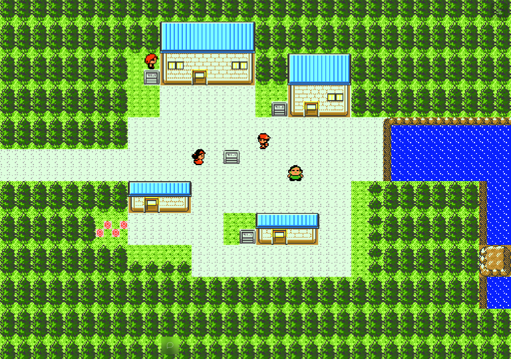
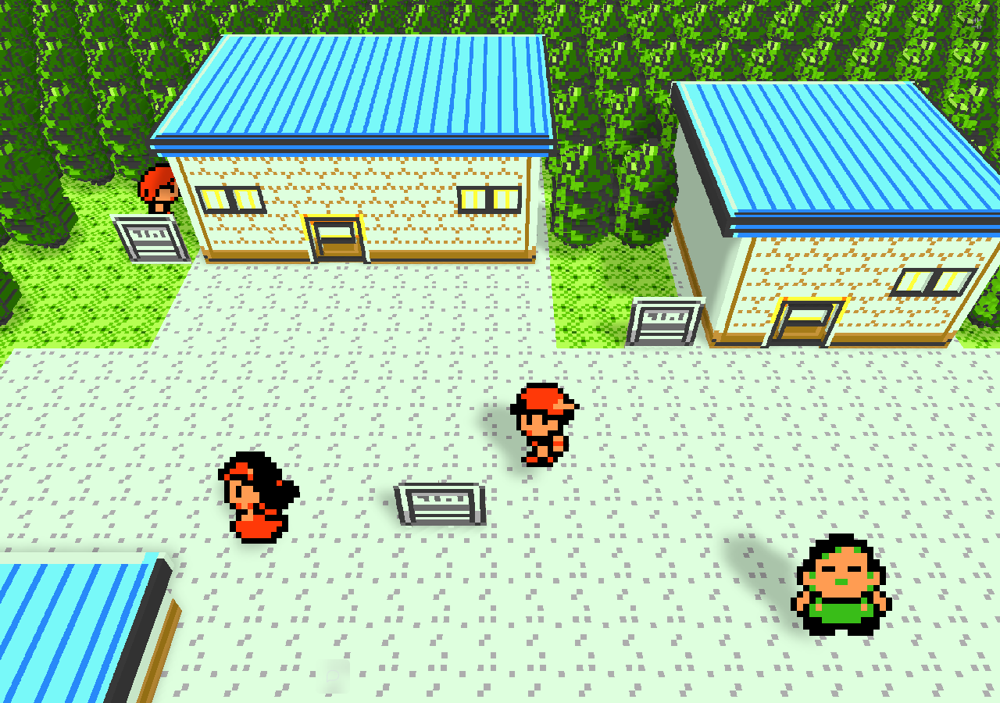

# Browser walking and map transition regression

The fullscreen compositor previously modified large Bevy image assets during
walking. Bevy's default image preparation allocates replacement GPU textures
for those modifications. A real Chromium capture reproduced repeated 928×912
texture allocations and full-image uploads while walking in New Bark Town.

Composed surfaces now retain GPU texture storage. A byte comparison finds the
smallest pixel rectangle containing all changes and uploads that region. The
original full CPU image remains available to both renderers. Identical classic
and visual-world tile grids share their composed image. Resolution, nearest
sampling, original tile pixels, game simulation, and map connections are unchanged.

## Reproduction

Install the pinned Playwright dependency with `npm ci`. Provide
Playwright storage state captured after an ordinary in-game save in New Bark
Town at (9, 7). Use the same saved state, game pack, browser, viewport, and view
settings for both bundles. Each run uses ordinary keyboard holds after warming
the scene. Metrics are collected in-page without per-frame bridge observations
or screenshots. One untimed midpoint observation proves displacement even on a round trip.
An observation and screenshot follow the final timed interval.

```sh
REQUIRE_RETAINED_TEXTURES=1 node tools/browser-walking-performance.mjs \
  'http://localhost:8080/?multiplayer=off' save-storage.json 2d walking-2d.json
REQUIRE_RETAINED_TEXTURES=1 node tools/browser-walking-performance.mjs \
  'http://localhost:8080/?multiplayer=off' save-storage.json 2.5d walking-25d.json
SCENARIO=lab-exit node tools/browser-walking-performance.mjs \
  'http://localhost:8080/?multiplayer=off' lab-storage.json 2d exit-2d.json
```

The exit fixture is an ordinary saved game in Elm's Lab at (5, 8). The test
holds Down and verifies arrival in New Bark Town. Texture allocation is expected
when entering a new map, so the zero-allocation walking assertion is not applied
to this scenario. Browser errors, wrong modes, hidden/unfocused windows, and
walking without displacement fail the test.

The changed-region unit tests reconstruct every output pixel, including alpha,
from the partial update and verify identical images require no upload.

## Audio preparation

MIDI synthesis previously ran synchronously on the browser game thread. A
module worker now runs the same canonical synthesizer and transfers its PCM
buffer. Rust polls without blocking and preserves pending command ordering,
then validates the sample rate, byte length, and canonical PCM hash before
caching and playing it. Worker errors remain errors; there is no main-thread
synthesis fallback. Native audio preparation is unchanged.

The initial renderer-only A/B used revision `e9142b0257ad2ccf317bffc223dc98591927dd0f`
and two alternating runs per mode. Its 2.5D p95 fell from 135–149 ms to 66–67 ms;
texture allocations fell from 72–86 to zero. The roughly 1.4-second worst frame
persisted, motivating the separate audio worker change. Final integrated
measurements are recorded separately because main advanced during this work.

`SCENARIO=route-exit` uses an ordinary save at New Bark Town (0, 8), after
receiving a starter, and holds Left for three seconds. It must finish on
Route 29. This exercises the real connected-map transition, including a new
music request, rather than teleporting or swapping maps through engine internals.

## Final alternating browser comparison

The final set used headful Chromium 145, 1280×900, identical frozen pack bytes
and identical real in-game saves. Each scenario ran before then after. The
baseline is `e9142b0`; the delivered build includes main through `cccc5f66` plus
this change. The raw frame intervals, audio preparation counts, locations,
load averages, and bundle hashes are in [browser-results.json](browser-results.json).
This integrated comparison includes intervening main fixes; it does not attribute
every timing difference solely to this patch.

| Scenario | p95 frame ms, before → after | Worst frame ms, before → after | Texture allocations, before → after |
| --- | ---: | ---: | ---: |
| 2d walking | 18.6 → 18.6 | 300.0 → 118.6 | 90 → 0 |
| 2d lab-exit | 18.6 → 18.6 | 332.9 → 117.7 | 504 → 486 |
| 2d route-exit | 18.6 → 18.6 | 317.5 → 118.6 | 285 → 241 |
| 2.5d walking | 33.6 → 18.2 | 298.6 → 18.8 | 171 → 0 |
| 2.5d lab-exit | 33.3 → 18.4 | 999.9 → 550.0 | 525 → 487 |
| 2.5d route-exit | 33.4 → 33.4 | 850.9 → 483.3 | 297 → 235 |

All six final scenarios had no browser/runtime errors, real movement or map
arrival, and completed canonical audio preparation. Both walking scenarios
had zero texture allocations; uploaded bytes fell by 80% in 2D and 85% in
2.5D. New-map asset allocations remain expected during transitions.

These are measured improvements, not a claim of stall-free transitions.
Cold 2.5D terrain construction remains synchronous and took approximately
0.5 seconds in the final checks. Earlier runs while other tasks compiled had
much larger pauses; those are not used as the final headline speedups.

The same-code compiler comparison (worker and retained textures in both)
measured the 2.5D lab exit at 716.7 ms worst-frame with size optimization and
600.0 ms with speed optimization; p95 was effectively unchanged at 18.1/18.2 ms.
Only `crystal-bevy` and `crystal-voxel-view` use optimization level 3; dependencies
retain the existing size profile. The gzip WASM download grows from
6.43 MiB to 10.07 MiB.

`AUDIO_PREPARATION=sync` is a benchmark-only experimental control. It replaces
the worker poll function with the same canonical synthesizer on the UI thread,
allowing an audio comparison without changing the WASM or source assets. The
application has no synchronous audio fallback. Both control and worker runs
completed PCM preparation and passed the Rust canonical hash check.

## Validation

- Locked WASM `web-release` build with `fullscreen-scaling,voxel-view`: passed.
- `npm ci --ignore-scripts` and `npm run test:browser`: 51 passed.
- Changed-region source module unit tests: 3 passed (including exact full-image
  reconstruction from partial uploads, alpha, and unchanged-surface suppression).
- Browser walking regression failed on baseline texture allocations and passed
  with retained textures in both modes.
- Final walking and both map transitions exercised real keyboard input in both
  modes; screenshots were inspected for complete rendered scenes.



