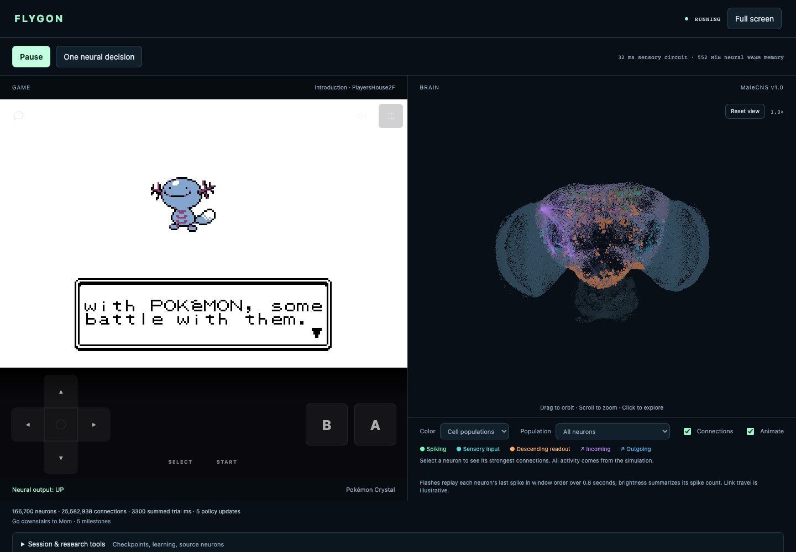
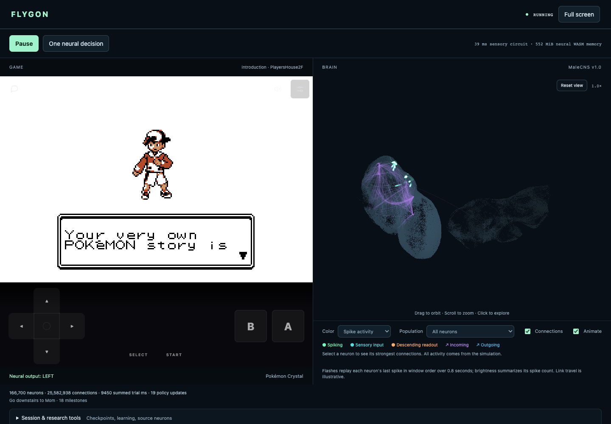

# Flygon

A local Rust/WASM connectome controller and interactive 3D anatomy viewer for
Geothite's Pokémon Crystal browser game. This is an experimental preview, version
0.3.0. Story control uses a connected sensory/descending circuit with an online
policy adapter. This architecture starts untrained; previous
[measured results](../../docs/FLYGON_RESULTS.md) describe the retired MBON controller.
The [MaleCNS follow-up](../../docs/FLYGON_MALECNS_FOLLOWUP.md) documents the expanded
descending readout, measured last-spike animation and additional source review.

## Screenshots and video

Game pane and connectome anatomy view:



Spike activity view:



[Screen recording (MP4, 24 seconds, silent)](media/flygon-demo.mp4).
The recording shows neural inputs during the game's opening introduction,
brain rotation, and the spike activity view. It is a UI demonstration,
not a story-completion result.

## Usage

1. Open `/flygon` on a Geothite server with the prepared brain data installed.
   The game and brain load automatically; progress cards show download status.
2. Select **Run brain** to start decisions, game inputs, and outcome learning.
   The default experiment is the story sensory-circuit profile.
3. Select **Pause** to stop. Manual game input and hiding the tab also pause the
   controller. Select **Run brain** to resume.

The game starts in classic 2D, regardless of the normal game's saved renderer
preference. The view toggle can enable 2.5D for the current session.

- Drag to orbit; scroll or pinch to zoom. Mouse and touch are supported.
- Arrow keys rotate a focused canvas; `+`/`−` zoom; `0` resets; Escape clears selection.
- Click a soma to inspect its source identity and strongest incoming/outgoing links.
- Purple arrows are incoming; blue arrows are outgoing. Green links mean their
  source spiked in the current measured window, not verified synaptic transmission.
- At most 48 links per direction are drawn, ranked by anatomical contact count.
  Selection reports visible totals and omissions. Lines join real somas; they are
  schematic connectivity, not reconstructed axons. Spiking cells are a luminous
  overlay so activity remains visible within the depth-shaded anatomy.
- Population selection focuses activity without reducing the simulated graph.
- Select **Spike activity** in the color menu to display measured neural activity.

Research tools are collapsed beneath the main view. Save brain and Export run
record retain learned state and evidence. Save the Pokémon game separately when
its save control is available. These are not atomic combined checkpoints.

## Local setup

The initial brain download is about 216 MiB and is cached when browser storage
is available. Allow at least 1 GiB of free memory; mobile memory capacity is not
guaranteed.

Follow the repository's [setup instructions](../../README.md#setup) for the game
server and separately supplied game content. Prepare the pinned MaleCNS
`graph.bin` and `metadata.json` using [Data preparation](#data-preparation).
Set `FLYGON_DATA_DIR` in `.env` to the absolute directory containing those files
before starting Docker Compose, then open `/flygon` on that server.

See [Flygon deployment](../../docs/deployment.md#optional-flygon) for the read-only
data mount and asset requirements. The main game can run without the brain data.

## Architecture

| Component | Responsibility |
| --- | --- |
| `crates/crystal-flygon/src/lib.rs` | Full retained graph, LIF dynamics, synaptic plasticity, configuration validation |
| `sensory.rs` | Separate terrain, dialogue, story and exploration channels; movement and repetition history |
| `circuit.rs` | Connected sensory inputs, descending readouts, policy learning and temporal credit |
| `operant.rs` | Story API entrypoints and explicit laboratory conditioning primitives |
| `view.rs` | Independent anatomy model, 3D perspective, depth shading, projection, picking and connection rendering |
| `interface.rs` | Structured sensory interface, source lookup and compatibility APIs |
| `checkpoint.rs` | Graph/model-checked brain memory and dynamics |
| `campaign.rs`, `conditioning.rs` | Reference controller ledger and controlled learning experiments |
| `bin/flygon-package.rs`, `preview.rs` | Native release assembly, hash verification, loopback preview and live source serving |
| `web-client/flygon*.js` | Thin DOM, pointer, worker and game-bridge transport; no neural or geometry engine |

The simulation and viewer run in separate workers using the same small WASM
module. The viewer receives real soma coordinates once, and sparse measured spike
counts and last-spike timing after each neural step. Camera gestures do not wait for neural trials.
All projection, picking, connection extraction and pixels are computed in Rust.

The import retains 166,700 neurons, 25,582,938 directed pair edges and 124,177,617
contacts. There are 139,662 source soma coordinates. Missing somas remain simulated
but are not drawn. The optional profile dropdown changes experiments; it does not
silently substitute a smaller neural graph.

## Tight source loop

Prerequisites: the repository Rust toolchain, `wasm32-unknown-unknown`, and
`wasm-bindgen-cli` **0.2.128**, matching Cargo.lock. An existing game bundle is
required; this workflow does not compile Pokémon.

```sh
# Only when Rust changes (small crate, not the game):
sh tools/flygon-build.sh
cargo build --locked -p crystal-flygon --bin flygon-package --profile web-release

# Native Rust source server; defaults shown, no compiler invocation:
FLYGON_GAME_ROOT=target/3d-web \
FLYGON_DATA_ROOT=/tmp/flygon-data/prepared \
FLYGON_PORT=33006 sh tools/flygon-dev.sh
```

Open `http://127.0.0.1:33006/flygon`. The loopback server uses the real local
UTC clock and disables multiplayer in the embedded game. CSS and `view.json`
refresh live without resetting the brain or game. **Reload tuning** reads config
changes without rebuilding or erasing learned synapses. HTML/JS changes require
page reload; save game and brain first. Rust changes require the small WASM build.
No rendering or configuration iteration invokes Cargo automatically.

`FLYGON_TOOL` can select an already built native packager binary. The old Node
preview server has been replaced by this Rust tool. Playwright is only used for
browser validation; it is not a public runtime dependency.

## Data preparation

Source files are pinned and hash-verified. Downloads and compiled data stay outside
Git. Preparing them is a one-time operation; visitors fetch only the prepared graph.

```sh
sh tools/flygon-data.sh /tmp/flygon-data/source
cargo build --locked -p crystal-flygon --features import --bin flygon-import --profile web-release
target/web-release/flygon-import /tmp/flygon-data/source /tmp/flygon-data/prepared
```

`dataset.json` declares source hashes, retained counts and the combined SHA-256
identity of graph.bin followed by metadata.json. The simulation validates that
identity. Attribution is in [ATTRIBUTION.md](ATTRIBUTION.md) and in the public UI.

## Assemble a public preview

```sh
# Uses existing game and neural bundles; no builds, downloads or deployment:
target/web-release/flygon-package \
  --workspace . --game target/3d-web \
  --data /tmp/flygon-data/prepared --out target/flygon-release-0.3.0

target/web-release/flygon-package --verify target/flygon-release-0.3.0
target/web-release/flygon-package --preview target/flygon-release-0.3.0 33008
```

Assembly validates runtime identities and profiles, verifies the pinned graph,
copies a standalone distribution without symlinks, and records every shipped file's
SHA-256 and size. It refuses existing output, missing assets and stale bindings.
An interrupted assembly never exposes a half-built release directory. Brain saves,
run captures, development tests and raw source tables are excluded.

The output contains the existing game inventory, the optional Flygon page, thin UI,
WASM, prepared graph, profiles, dataset attribution and a release manifest. It does
not add a ROM, duplicate game content or upload visitors' brain state. Open
`/flygon`; root `/` is the existing game. Serve the assembled directory through
the existing `crystal-web-server` or the existing hosted game origin/clock. Preserve
WASM MIME types and same-origin asset paths. The Rust preview server is loopback-only
and supplies real local time; it is not a public production server. Deployment is a
separate action. This optional distribution does not alter the base Docker image.

Initial neural data is about 216 MiB. The simulation's measured WASM memory is
552 MiB, with additional viewer, game and browser memory. Recommend at least 1 GiB
free; mobile memory capacity is not guaranteed. The preview does not claim offline
service-worker support. After assets are available, local preview requires no
external simulation service.

## Reward curriculum and evidence

The default teacher is `story-events-v1` in Rust `story.rs`. It reads actual
post-action game telemetry: completion event flags, script scene transitions,
quest key items, TM/HM acquisition, field moves learned and successfully used,
Pokédex additions, level high-water marks, all 16 badges and Hall of Fame.
Elm/Mr. Pokémon dialogue and quest handoffs use the same actual script observation
as later Johto, Kanto and Red events. New pages require a real talked-to object.
There is no map ranking, coordinate target, distance reward or Route 30 stop.
First visits to a town, route or interior earn a small policy-training outcome.
Visited places persist in the brain ledger; revisits, door loops and loading a
save do not pay.

The teacher is an engineered privileged game-state adapter, not fly perception.
It evaluates consequences only; it never supplies a correct button or changes
progression. Completion prefixes are declared in `story.rs`; arbitrary visibility
flags do not pay. Successful field actions are recorded only after the game accepts
the move. Strength is observed through its actual activation flag. Each durable
milestone pays once per saved brain. Loading an advanced save or resuming after
human control baselines existing progress without giving the brain credit.

Story mode encodes player-visible local terrain, objects, menu state, dialogue,
battle text and party condition. A signed, density-normalized feature projection
drives up to 192 annotated visual-projection/central sensory neurons plus 64
Kenyon cells drawn from actual plastic synapses. Inputs are
chosen across annotated types and hemispheres using conducting connectivity.
Separate spatial quadrants, objects, dialogue/menu, party/battle and scene channels
reduce interference between observations. Up to 256 reachable
descending neurons form a separate readout population. Forward and reverse
reachability restrict the interface to measured pre-to-post paths of at most
12 hops; all neurons and edges remain in the simulator. No direct current is
injected into the output neurons, and no button cue is fed into the sensory path.

One 150 ms neural window produces action probabilities. Select is excluded by
default (`allow_select: false`), including from random exploration; any Select
outcome still receives negative feedback. Membrane and synaptic state continue
between decisions. The adapter reads unit-normalized measured spikes and membrane
responses; silent outputs remain silent. Separate learned heads for visible UI
modes, walking objectives, and directional sensory cues prevent conflicting
rewards from training one walking habit. This
context selection is an explicit engineered adapter input, not an anatomical claim.
Start is excluded during the opening overworld errands until Elm receives the
Mystery Egg. Dialogue pages without choice menus exclude directions. Both the
learned policy and random exploration respect these explicit interface constraints.
Each head starts with zero weights and a uniform policy over enabled buttons. An eight-transition
actor-critic update trains this engineered readout. A learned value baseline,
discounted returns, normalized bounded updates, 3% exploration and a small
entropy bonus reduce noisy credit and premature action lock-in. Nonzero outcomes
update the policy immediately; neutral sequences still train in eight-step batches.
Game rewards pair the active sensory trace with PAM01 stimulation; aversive outcomes
pair it with PPL101 stimulation. The existing dopamine-gated KC eligibility rule
can change actual KC-to-MBON synapses during this feedback window. Inference keeps
plasticity off. The engineered policy adapter remains separate from those synapses.
The sensory prosthesis reserves 64 inputs in the actual plastic KC-to-MBON pool,
alongside visual/sensory neurons. These cells encode observations, never candidate
buttons. This supplies active eligibility traces instead of delivering dopamine
to an inactive memory circuit. Story-direction channels receive stronger input
current while ordinary spatial input is attenuated, so the breadcrumb is salient.

Opening-story breadcrumbs lead downstairs, to Mom, Elm, a starter, the town exit,
Cherrygrove, Mr. Pokemon, and the return to Elm. Their directional scent enters the
sensory projection; it cannot choose or replace a button. Path costs use remembered
terrain and failed movement edges, excluding unknown cells entirely. When no
connected route is known, frontier exploration takes over. These are
approximate routes: directional collision rules and changing NPCs can invalidate a
predicted step. New best progress pays once per target, preventing back-and-forth
reward farming. Milestone and battle rewards continue beyond this opening curriculum.
Alongside the story scent, an exploration scent points toward reachable remembered
land bordering unseen terrain. Revealing at least three new terrain cells from a
new player tile pays a small 0.05 curiosity reward; revisits do not pay. This works
on every map and gives a fallback when the story route is unknown or obstructed.
First best story approach (2.0), recovery toward a known route (0.3), and new places
(2.5) outweigh curiosity (0.05). Visiting new ground can pay curiosity even in a
small room whose whole layout was already visible. Short-loop penalties prevent
repeated recovery rewards from becoming a profitable oscillation. Necessary backtracking
is neutral unless it becomes a repeated short loop; failed moves update the route.
Every Select outcome, refusals, blocked movement and repeated short loops receive
aversive feedback. Empty-floor A/B presses and unnecessary menu opening before a
starter also cost. Staying in those menus costs 0.25 per action; closing them pays
0.5, less than the 2.0 opening cost. Real setup-page changes receive positive feedback.

Runtime knobs in `flygon-operant.json`: `appetitive_pulse_ms` and
`aversive_pulse_ms` default to 200 ms for strong outcomes (50 ms for small outcomes),
`breadcrumb_reward` is 2.0 in the shipped profile, and `bad_action_penalty` is 2.0.
The shipped adapter learning rate is 0.5; subthreshold readouts are normalized
before training so low physical amplitude does not make updates ineffective.
New places pay 2.5; major story events pay 2.0. The current target and delivered
reward/shock pulse appear in the story status. Pulse magnitude and game-event
mapping are engineering choices, not measured biological calibrations.

Research basis: [Liu et al. 2012](https://www.nature.com/articles/nature11304)
demonstrated PAM reward reinforcement; [Perisse et al. 2016](https://pubmed.ncbi.nlm.nih.gov/27210550/)
studied PPL1 aversive learning and mushroom-body output changes. These results
motivate compartment-specific stimulation paired with active sensory traces, not
a claim that every PAM/PPL cell has one universal valence or that this game
controller reproduces biological learning in full.

For a neural/UI-only release, build only `crystal-flygon`, generate its wasm-bindgen
bundle, and run `tools/version-browser-bundle.sh WEB_DIRECTORY --flygon-only`.
The resulting Flygon assets can overlay the existing production image; the game
WASM, server binary, external content and persistent data need no rebuild.

The interface identity changed. Older controller checkpoints are rejected rather
than silently reinterpreted. New checkpoints retain the policy, critic, pending rollout,
progress ledger and neural state; human takeover clears pending credit. Game
saves are separate and remain usable.

The brain loads automatically on entry. The browser caches the graph and metadata
under their dataset digest after Rust verifies their combined identity. A corrupt
cache entry is evicted and fetched again; unavailable browser storage does not
prevent loading. Population filters distinguish actual sensory inputs and
descending readouts; activity brightness reflects measured spike counts. Display
links are bounded schematic connections, not reconstructed axons.

Design references: [FlyVis](https://github.com/TuragaLab/flyvis) motivates
connectome-constrained dynamics with task-trained readouts;
[NeuroMechFly](https://neuromechfly.org/) motivates closed-loop sensory integration
and a descending interface; [FlyCube](https://github.com/lntegrals/flycube-public/blob/main/docs/methodology.md)
provides the disjoint-input/readout and directed-path pattern. This implementation
uses the existing Rust LIF engine and online readout learning, not their trained
models or a claim to reproduce their results. FlyCube's published checkpoint
results are from legacy reversed connectivity and are not evidence for Flygon.

Battle feedback uses actual enemy HP minima, defeated opponent indices and the
engine's terminal result (win, capture, loss or escape). Healing an opponent and
repeating the same damage does not pay again. Leaving a battle alone is not a win.
Menus and backtracking are neutral, so using the party menu for HMs or returning to
Elm is not punished. Reward histories persist in brain checkpoints. Scenario
checks cover story transitions, seven machines, 16 badges, terminal battles,
deduplication and save baselines; they are not evidence of a full story playthrough.

“Run brain” restores game submissions after human takeover. A control epoch rejects
in-flight decisions/outcomes from before the handoff. Human interventions remain
recorded as assistance.

## Render review

With Playwright and its browsers already installed, review the **assembled** preview:

```sh
node tools/flygon-review.mjs
FLYGON_BROWSER=firefox node tools/flygon-review.mjs
FLYGON_BROWSER=webkit node tools/flygon-review.mjs
```

The harness opens a separate browser session, waits for the full graph to autoload, takes a real
neural decision with game submission off, selects source MBON01, and renders its
actual incoming/outgoing edges. It checks that orbit changes pixels while neural
state remains fixed, captures desktop and narrow layouts, and exercises Chromium
touch orbit/pinch. It records missing assets and browser exceptions. Output goes to
`target/flygon-evidence/release`; use `FLYGON_EVIDENCE_DIR` to override. The default
is background validation with software WebGL for Chromium; use `FLYGON_HEADLESS=0`
only when a visible browser is wanted. No compiler runs in this loop. No neural data or decisions are generated by JS.

## Hidden Geothite route

Production serves this optional controller at `/flygon` (also `/flygon/`). The
normal root stays the game and contains no Flygon navigation link. The brain loads
on entry; Run starts gameplay. The Docker build takes external game content from
BuildKit named context `game_content`, containing `core-modular.browser.crystalpack`.
Prepared connectome files are a read-only runtime mount at
`/srv/crystal/web/flygon-data`; set `FLYGON_DATA_DIR` for the supplied Compose file.
No game content or connectome binary belongs in Git. The neural WASM/glue and
workers are content-addressed during the production build.

Handoff render check (uses a fresh browser save and real neural button inputs):

```sh
FLYGON_URL=http://127.0.0.1:33100/flygon node tools/flygon-handoff-review.mjs
```

Render and handoff reviews run in the background by default, with Chromium
software WebGL where needed. Set `FLYGON_HEADLESS=0` only to intentionally open a
visible review window. These checks never open the game save-import dialog.
The check exports the real run record, verifies telemetry version 1 and resumed
neural submissions, and saves a screenshot. It does not claim story completion.

## Story teacher penalties

The teacher assigns -2 to every Select outcome and newly shown invalid-use
warnings (including Oak's warning), -2 to battle losses, and -0.05 to inactivity.
Losses suppress simultaneous rewards, including blackout respawn-location novelty. Warning text cannot earn NPC dialogue reward.

Twelve consecutive decisions without movement, dialogue/menu changes or battle
activity incur a mild negative outcome. New exploration tiles reset the inactivity
budget; first visits can also receive the small curiosity reward described above. Known routes allow 255 decisions without
an achievement before a mild ongoing cost begins. After that, travel covering at
least 16 distinct tiles in the last 64 moves stays neutral, protecting long return
trips while charging small repeated loops. Distance from a target is never penalized. Actual story, dialogue or battle
progress resets the budget. Animation observations do not advance inactivity clocks.
Non-damaging battle turns reduce the inactivity clock without earning rewards.
Stale warning status cannot penalize dismissal or unrelated dialogue. Counters,
explored tiles and the recent travel window survive brain saves and inactivity
counters are exposed in teacher telemetry. These are shaping rules, not a
claim of measured story mastery; existing learned preferences may need retraining.

### Measured loading progress

See [EXPLORATION.md](EXPLORATION.md) for inspected controller repositories,
sensory-context learning, opening-menu exclusion, and exploration measurements.

For gameplay tuning, run `FLYGON_URL=http://127.0.0.1:33105/flygon
FLYGON_CDP_PORT=9338 FLYGON_WATCH_SAMPLES=180 node tools/flygon-runtime-watch.mjs`
as one shell command. The private browser records actual neural decisions,
feedback, game observations, and screenshots under `target/flygon-runtime-watch`.
It starts autonomous play without choosing movement inputs. Set
`FLYGON_EVIDENCE_DIR` to keep separate runs.

After rebuilding only the neural WASM when Rust changes, run
`node tools/flygon-runtime-reload.mjs` against that development session. It pauses
play, replaces the neural worker, restores its checkpoint, applies the current
operant configuration, and resumes without resetting the game. JSON tuning needs
no compilation. This helper targets the unversioned development assets.

An observed runtime-tuned run left the upstairs bedroom, obtained Mom's Pokégear,
left home, entered Elm's lab, and advanced to choosing a starter. This establishes
that run's progress, not repeatable cold-start success or full-story mastery.

The game and Flygon loading cards show bytes received for each large asset.
`web-client/asset-progress.js` only streams browser transport and updates the DOM;
game, neural, and rendering work remains in Rust/WASM. Workers forward progress
messages separately from command replies. The game pack uses an optional browser
transport hook; standalone WASM embedders retain the Rust fetch fallback.

The server supplies `X-Asset-Bytes` with the decoded file size, including when
serving precompressed WASM. A compressed `Content-Length` is never used as the
percentage denominator. The pinned dataset supplies graph and metadata sizes.
Unknown lengths display received bytes without a percentage. Initialization is
indeterminate and ends only when the actual operation finishes. The game card
closes after the first game observation and audio initialization; the brain card
closes after anatomy initialization.

For a background render check with real throttled downloads, run
`node tools/browser-loading-review.mjs http://127.0.0.1:33104 target/loading-evidence`.
Screenshots and measured intermediate states remain ignored under `target/`.
UI changes need only a reload. Rust game transport changes require rebuilding the
game WASM once; loading-card styling and progress presentation do not.

### Interrupted gameplay and release trials

The runtime watcher treats screenshots as optional. At safe overworld boundaries
it pauses new decisions, waits for the previous outcome, uses the normal game
save API, and writes a paired checkpoint generation. A `latest-checkpoint`
pointer is atomically replaced only after the game, brain, browser save storage
and checksum manifest exist. Runtime observation snapshots are also replaced
atomically. SIGINT/SIGTERM request a safe stop; the previous complete generation
remains usable if the process dies before another saveable boundary.

Set `FLYGON_RESUME` to a checkpoint generation directory to continue it. The
watcher checks save/brain hashes and the game module URL, uses the normal Continue
menu, checks the restored location, restores the neural checkpoint and resumes.
Resumed runs are labeled; they are not fresh-start trials. Use the same origin
and pinned game bundle for restore. `tools/flygon-runtime-save.mjs` can request
an extra safe checkpoint through `FLYGON_CDP` during a watched run.

Set `FLYGON_SEED` to a nonnegative integer for a reproducible alternative action
sampling seed. This changes sampling only, not initial game state or weights.
Use different evidence directories for repeats and report every tested seed.
Pin the deployed image identity, game WASM digest and served game-content digest
before evaluating. Source-preview neural reloads remain exploratory runs; the
release candidate must be tested fresh against the pinned game.

The engine handoff regression can replay a real checkpoint from Elm's lab's
central aisle after obtaining a starter:

```sh
FLYGON_RESUME=target/run/checkpoint-GENERATION \
FLYGON_GAME_URL='http://127.0.0.1:33127/?multiplayer=off&flygon=1' \
node tools/flygon-potion-regression.mjs
```

It uses normal buttons, records the Potion receipt and lab exit, and deliberately
isolates the engine from the neural policy. It does not count as a fresh opening.
